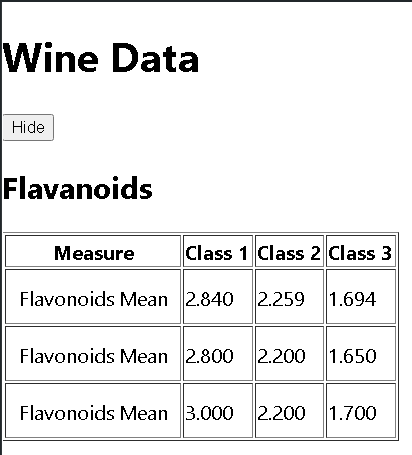
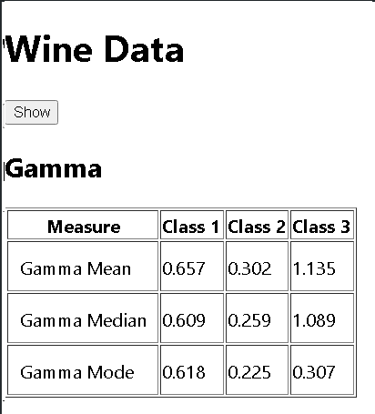

# Internship Assignment

This project involves calculating mean, median, mode from a dataset of wine.

## Challenges Faced

Don't know much about Typescript so learned about typescript and also about yarn because I use npm mostly

## Lessons Learned

Thank you for considering my submission for the Data Filtering Project. This README.md file provides comprehensive documentation on design decisions, challenges faced, and other relevant details.

## Usage

## Available Scripts

In the project directory, you can run:

### `yarn start`

Runs the app in the development mode.\
Open [http://localhost:3000](http://localhost:3000) to view it in your browser.

The page will reload when you make changes.\
You may also see any lint errors in the console.

### `yarn test`

Launches the test runner in the interactive watch mode.\
See the section about [running tests](https://facebook.github.io/create-react-app/docs/running-tests) for more information.

### `yarn build`

Builds the app for production to the `build` folder.\
It correctly bundles React in production mode and optimizes the build for the best performance.

The build is minified and the filenames include the hashes.\
Your app is ready to be deployed!

See the section about [deployment](https://facebook.github.io/create-react-app/docs/deployment) for more information.

## Thank you for the opportunity. I look forward to your feedback.

## Screenshots

